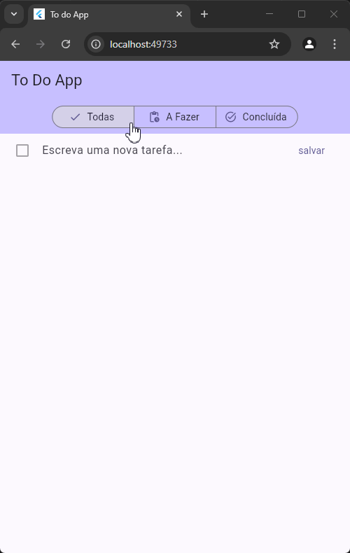

<div align="center">
  
  
  
  # Todo App - Flutter & Dart

  
  
  ### Aplicativo de Lista de Tarefas desenvolvido durante o curso da Udemy
</div>

## 📱 Sobre o Projeto

Aplicativo de gerenciamento de tarefas que demonstra conceitos importantes do Flutter e Dart, com foco em gerenciamento de estado e persistência de dados.

## 🛠️ Tecnologias Utilizadas

### Flutter
- **SegmentedButton**: Implementação de filtros de visualização
- **ValueListenableBuilder**: Atualização reativa da interface
- **StatefulWidget & StatelessWidget**: Gerenciamento de estado dos componentes
- **ReorderableListView**: Reordenação de tarefas por drag and drop

### Dart
- **Enums**: Definição de estados de filtro
- **Factory Constructors**: Criação de objetos Todo
- **Abstract Classes**: Definição de contratos de serviços
- **Async/Await**: Operações assíncronas

### Packages
- **Hive**: Persistência local de dados
- **GetIt**: Injeção de dependências
- **UUID**: Geração de IDs únicos

## ✨ Funcionalidades

- ✅ Adicionar novas tarefas
- 🔄 Reordenar tarefas (drag and drop)
- 🔍 Filtrar por status (Todas, A Fazer, Concluídas)
- 📝 Editar tarefas existentes
- ❌ Remover tarefas
- 💾 Persistência automática

## 📁 Estrutura do Projeto

```
lib/
├── controller/      # Lógica de controle
├── data/           # Camada de dados
├── model/          # Modelos de dados
├── notifiers/      # Gerenciamento de estado
├── screens/        # Telas do app
├── service/        # Serviços e dependências
└── widgets/        # Componentes reutilizáveis
```
## **🎯 Aprendizados Principais**

1. **Gerenciamento de Estado**
    - Uso de ValueNotifier
    - Atualização reativa da UI
2. **Arquitetura Limpa**
    - Separação de responsabilidades
    - Injeção de dependências
3. **Persistência de Dados**
    - Implementação do Hive
    - Conversão JSON
4. **Widgets Avançados**
    - Reordenação com drag and drop
    - Filtros segmentados

## **🚀 Como Executar**

# Clone o repositório

git clone https://github.com/seu-usuario/todo-app.git

# Entre na pasta do projeto

```
cd todo-app
```

# Instale as dependências

```
flutter pub get
```

# Execute o app

```
flutter run
```
<div align="center"> Desenvolvido com 💙 durante o curso da Udemy </div> ``